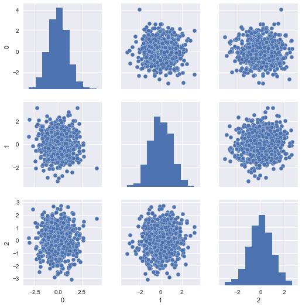
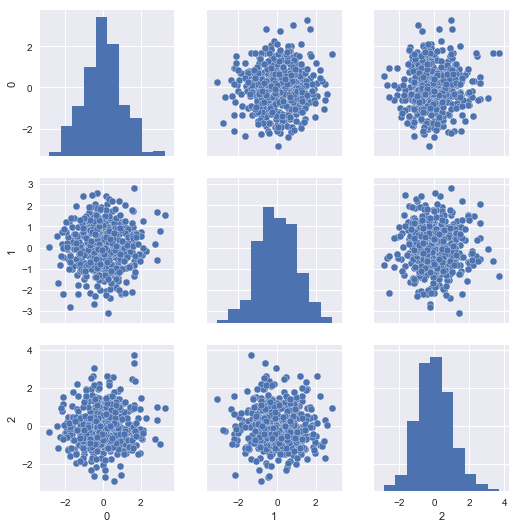
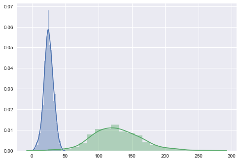

Throughout my tenure in the field of data science and machine learning, I've had the privilege to interview a lot of candidates. Some interviews have gone splendidly; others have gone horrendously. And, to the credit of those who have bombed, sometimes you're just nervous and trip up, I get it. It happens to all of us. But other times&mdash;more often than I'd care to admit&mdash;I have been witness some truly bad practices that outright scare me. 

For my part, I've participated in my own fair share of really bad interviews from the candidate side, and I always appreciate when I'm treated gently. That said, I want to learn where I've gone wrong, and so I always try to make interviews&mdash;whether I'm the participant or the proctor&mdash;a learning experience. As data scientists, we should strive to learn from those who have been around longer than us, and teach those who haven't been in the field as long. 

Therefore, in this series of posts, I'm going to talk about the **most common mistakes** I witness data science candidates making.

## Fitting your test set

If you've taken any number of ML classes, you know this is a no-no. And yet, it's such a common mistake that I have to wonder where the confusion lies.

Perhaps the blame lies in the classroom, as many academics don't have to worry about models drifting over time, as those in the industry do, or maybe it's just a concept that doesn't stick until you've been bitten by the fallout. Nevertheless, here's a common pattern I see in interview code (applied to everyone's *favorite* dataset, Iris):


from sklearn.preprocessing import StandardScaler
from sklearn.model_selection import train_test_split
from sklearn.datasets import load_iris

# load and split the data
X, y = load_iris(return_X_y=True)
X_train, X_test, y_train, y_test = train_test_split(X, y, 
                                                    test_size=0.3, 
                                                    random_state=42)

# scale the data
X_train_scaled = StandardScaler().fit_transform(X_train)
X_test_scaled = StandardScaler().fit_transform(X_test)


This is a *huge* no-no! Notice the very last line, where we have `fit` our test set in order to transform it. If it's not quite landing as to why this should be avoided like the plague, let's consider the following scenario...

### Example: covariate shift

Imagine you've fit a model to estimate whether a mechanical part is going to give out (an actual problem I worked on several years ago). Let's say you have the following setup:


import numpy as np
from sklearn.model_selection import train_test_split
from sklearn.preprocessing import StandardScaler
from sklearn.linear_model import LogisticRegression
from sklearn.metrics import accuracy_score

# initialize a random state, create several "normal" features
rs = np.random.RandomState(42)
X = rs.normal(25., 7., (1000, 3))

# if the last feature is >= 35, the part WILL FAIL
y = X[:, -1] >= 35.

X_train, X_test, y_train, y_test = train_test_split(X, y, 
                                                    random_state=rs, 
                                                    test_size=0.25,
                                                    stratify=y)

# transform your data, and fit/predict with a logistic regression
# Scale
X_train_scaled = StandardScaler().fit_transform(X_train)
X_test_scaled = StandardScaler().fit_transform(X_test)

# Fit, predict
clf = LogisticRegression().fit(X_train_scaled, y_train)
preds = clf.predict(X_test_scaled)
print("Test accuracy: %.3f" % accuracy_score(y_test, preds))


On the surface, this doesn't look too bad. In fact, if you run this exact snippet of code, you'll get 98.8% accuracy on your test set, and that didn't even require any significant pre-processing or hyper-parameter tuning! However, there's a very dangerous, hidden assumption in this code. **It assumes that your distributions will never change**.

"Wait"&mdash;you say. "How am I making that assumption?"

Well, it may not be an explicit assumption, but consider these lines:


# transform your data, and fit/predict with a logistic regression
# Scale
X_train_scaled = StandardScaler().fit_transform(X_train)
X_test_scaled = StandardScaler().fit_transform(X_test)


What are you doing? You're fitting your test set with a scaler. That means when *new* data passes into your system, you'll have to do the same. Consider the following excerpt, where you have new data flowing into your model in your production environment:


# here's the new data coming in. let's pretend the last feature
# has drifted upward for some reason
X_new_data = np.random.RandomState(100).normal(25., 7., (500, 3))
X_new_data[:, -1] *= 5.

# and now let's score the model
X_new_data_scaled = StandardScaler().fit_transform(X_new_data)
preds = clf.predict(X_new_data_scaled)


What do you expect will happen? Well, we know from our previous analysis (and even our problem setup) that when the last feature is >= 35, we should be predicting `True`. And yet, if you examine your predictions here, you'll see that we only predicted `True` 7% of the time, even though nearly every value was greater than 35.

*Why is this?*

Well, our model was fit on the Z-scores of the training data (that is, the centered and scaled features). We can visualize those like so:


import seaborn as sns
sns.pairplot(pd.DataFrame(X_train_scaled))


The problem is, our scaled test set resembles the same, since it was scaled with respect to itself rather than the training set:


sns.pairplot(pd.DataFrame(X_new_data_scaled))


If we look at the distributional differences in the offending features between our training set and new data, we should immediately have recognized this problem, but with the current setup, we'll never diagnose it properly in time; the mechanical parts will likely fail without us having issued a warning:


sns.distplot(pd.DataFrame(X_train[:, -1]), kde=True)
sns.distplot(pd.DataFrame(X_new_data[:, -1]), kde=True)


### Preventing this problem

Avoiding this problem is fairly straight-forward: **don't fit anything on your test set!**

Scikit-learn makes this very simple with the [`Pipeline`](http://scikit-learn.org/stable/modules/generated/sklearn.pipeline.Pipeline.html) object. Here's how we can rework our model to catch the covariate shift properly:


from sklearn.pipeline import Pipeline

# stuff it all into a pipe
pipe = Pipeline([
    ('std', StandardScaler()),
    ('clf', LogisticRegression())
]).fit(X_train, y_train)

# apply the pipe directly to your test data
test_preds = pipe.predict(X_test)
new_preds = pipe.predict(X_new_data)

# we should have roughly the same test accuracy:
print("Test accuracy: %.5f" 
      % accuracy_score(y_test, test_preds))

# and we should have predicted True for more
# than 7% of the "new" data
print("{0}% predicted True".format(
    new_preds.sum() / new_preds.shape[0] *100))


By using a pipeline, we can ensure that our model is only ever fit on our *training* data, and can be used later to *transform* our test data. If you run the snippet above, we should get roughly the same test accuracy (99.2%), and you'll see that we predict `True` for >99% of the "new" data&mdash;way up from the previous 7%! You may just be able to warn someone about the impending mechanical failure in time!

## In summary

Hopefully it should be clear now (if it wasn't before) why you should *never* fit anything on your test set. You can avoid this headache by using the [`Pipeline`](http://scikit-learn.org/stable/modules/generated/sklearn.pipeline.Pipeline.html) from scikit-learn. The full code for this example is located in the [code folder](https://github.com/tgsmith61591/tgsmith61591.github.io/blob/master/code/2018-07-23-never-fit-on-test.ipynb).

In the next post, we'll cover another horrid habit: **data dredging**.

